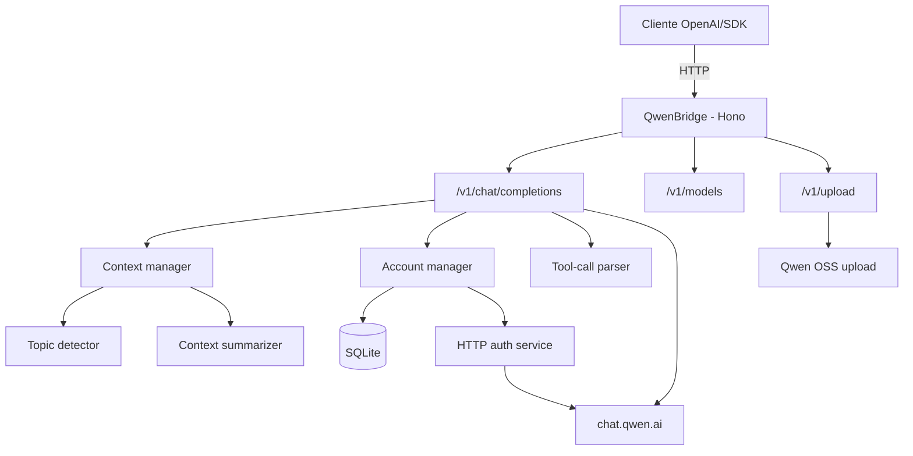

# QwenBridge

API compatível com OpenAI que conecta clientes ao **Qwen (`chat.qwen.ai`)** por HTTP direto, sem automação de navegador, com suporte a múltiplas contas, tool calling robusto, uploads multimodais e sessões persistentes. Esta branch também inclui rotação com cooldown, variantes `-no-thinking`, detecção de mudança de tópico, sumarização de contexto, cache comprimido e observabilidade básica.

[](https://github.com/johngbl/QwenBridge/actions/workflows/ci.yml)
[](https://www.typescriptlang.org/)
[](https://hono.dev/)
[](#)
[](LICENSE)

---

## Principais funcionalidades

- **Compatibilidade OpenAI** — Endpoints `/v1/chat/completions`, `/v1/models`, `/v1/chat/completions/stop` e `/v1/upload`.
- **Modelos Qwen atuais** — Funciona com a família `qwen3.x` e expõe variantes sintéticas `-no-thinking` para respostas sem reasoning.
- **Múltiplas contas** — Rotação round-robin, cooldown automático por rate limit e inicialização paralela das contas configuradas.
- **Persistência de sessão** — Cookies/JWT do Qwen persistidos por conta no SQLite.
- **Login automático** — Pode usar `QWEN_EMAIL`/`QWEN_PASSWORD`, contas persistidas em SQLite ou sincronização via `QWEN_ACCOUNTS`.
- **Uploads multimodais** — Imagens, vídeo, áudio e documentos enviados ao OSS do Qwen e reutilizados no chat.
- **Tool calling robusto** — Parser tolerante a stream fragmentado, JSON malformado e também blocos XML/Hermes-style.
- **Validação de tools** — Linter para nomes, descrições e JSON Schema antes do registro.
- **Gerenciamento de contexto** — Truncamento, sumarização opcional, detecção opcional de mudança de tópico e preservação do encadeamento de sessão upstream.
- **Cache com compressão Brotli** — TTL em memória, métricas e serialização segura de primitivos.
- **Observabilidade** — `/health`, `/metrics`, watchdog e métricas Prometheus.
- **Deploy simples** — `npm`, Docker e graceful shutdown.

---

## Arquitetura



---

## Modelos e contexto

Hoje a branch está alinhada com os modelos reais mais recentes retornados por `/v1/models`:

- `qwen3.7-plus` → contexto interno configurado em `1_000_000`
- `qwen3.7-max` → contexto interno configurado em `1_000_000`
- `qwen3.6-plus` → contexto interno configurado em `1_000_000`
- `qwen3.5-flash` → contexto interno configurado em `1_000_000`
- **Fallback para modelos desconhecidos** → `262_144`

### Variantes `-no-thinking`

O proxy expõe automaticamente versões como:

- `qwen3.7-plus-no-thinking`
- `qwen3.7-max-no-thinking`
- `qwen3.6-plus-no-thinking`
- `qwen3.5-flash-no-thinking`

Essas variantes usam o mesmo modelo base, mas desativam o modo de thinking no payload enviado ao Qwen.

---

## Pré-requisitos

| Dependência | Versão mínima | Observação |
|---|---:|---|
| Node.js | 20+ | Recomendado usar LTS |
| npm | 9+ | Incluído com Node |
| Docker | opcional | Para deploy em container |

---

## Instalação

### Via npm

```bash
git clone https://github.com/johngbl/QwenBridge.git
cd QwenBridge
npm install
```

### Via Docker

```bash
docker-compose up -d
```

---

## Início rápido

Crie um `.env` na raiz. O `.env.example` contém apenas as opções mais comuns; a lista completa está documentada abaixo.

### Exemplo mínimo — uma conta

```env
PORT=3000
HOST=127.0.0.1
API_KEY=troque-por-uma-chave-forte

QWEN_EMAIL=seu-email@exemplo.com
QWEN_PASSWORD=sua-senha
```

### Exemplo mínimo — múltiplas contas via env

```env
PORT=3000
HOST=127.0.0.1
API_KEY=troque-por-uma-chave-forte

QWEN_ACCOUNTS=user1@example.com:senha1,user2@example.com:senha2
```

### Iniciar

```bash
npm start
```

O servidor autentica no Qwen por HTTP puro usando `QWEN_EMAIL`/`QWEN_PASSWORD` ou contas salvas/sincronizadas no SQLite.

## Testes

```bash
npm test
```

O script principal roda primeiro os testes com mock e deixa os testes live reais por último.

Comandos úteis:

- `npm run test:mock` — roda só os testes com mocks
- `npm run test:live` — roda só os testes reais/live

> Os testes live dependem de contas/sessões reais do Qwen e tendem a ser mais lentos.

---

## Todas as variáveis de ambiente

## Rede e segurança

| Variável | Default | Descrição |
|---|---|---|
| `PORT` | `3000` | Porta HTTP do proxy. |
| `HOST` | `0.0.0.0` | Host de bind do servidor. Para uso local, prefira `127.0.0.1`. |
| `API_KEY` | vazio | Protege todas as rotas `/v1/*` com `Authorization: Bearer ...`. |

## Autenticação e sessão Qwen

| Variável | Default | Descrição |
|---|---|---|
| `QWEN_EMAIL` | vazio | Credencial de login HTTP para o modo single-account/global. |
| `QWEN_PASSWORD` | vazio | Senha usada junto com `QWEN_EMAIL`. |
| `QWEN_ACCOUNTS` | vazio | Lista de múltiplas contas no formato `email1:senha1,email2:senha2`. Essas contas são sincronizadas para o SQLite. |
| `DELETE_ALL_CHATS_ON_SHUTDOWN` | `false` | Quando `true`, envia `DELETE /api/v2/chats/` no shutdown do proxy para limpar todos os chats do Qwen de todas as contas carregadas (ou da sessão global, se não houver contas). |
| `USER_AGENT` | Edge 148 no Windows | User-Agent usado nas chamadas HTTP diretas ao Qwen. |
| `QWEN_BX_UA` | vazio | Header anti-bot opcional, caso o Qwen volte a exigi-lo. |
| `QWEN_BX_UMIDTOKEN` | vazio | Header anti-bot opcional, caso o Qwen volte a exigi-lo. |
| `QWEN_BX_V` | `2.5.36` | Versão `bx-v` enviada nas chamadas HTTP. |

## Timeouts

| Variável | Default | Descrição |
|---|---|---|
| `HTTP_TIMEOUT` | `10000` | Timeout HTTP genérico. |
| `CHAT_TIMEOUT` | `120000` | Timeout máximo de uma geração upstream do Qwen. |

## Cache e compressão

| Variável | Default | Descrição |
|---|---|---|
| `CACHE_TTL` | `3600` | TTL padrão do cache em memória, em segundos. |
| `RESPONSE_TTL` | `1800` | TTL para respostas cacheáveis, em segundos. |
| `CACHE_COMPRESSION_ENABLED` | `true` | Liga compressão Brotli no cache. |
| `CACHE_COMPRESSION_THRESHOLD` | `1024` | Tamanho mínimo, em bytes, para comprimir um valor. |
| `CACHE_COMPRESSION_LEVEL` | `6` | Nível Brotli (`1` a `11`). |

## Contexto e qualidade de conversa

| Variável | Default | Descrição |
|---|---|---|
| `TOPIC_DETECTION_ENABLED` | `true` | Liga a detecção de mudança de tópico. |
| `TOPIC_DETECTION_CONFIDENCE` | `0.7` | Limiar da confiança de mudança de tópico. Quanto maior, mais conservador. |
| `CONTEXT_MODE` | `thread-native` | `thread-native` reutiliza a thread do Qwen e envia só a mensagem/delta atual; `full-history` reenvia o histórico OpenAI completo. |
| `CONTEXT_SUMMARIZATION_ENABLED` | `true` | Liga a sumarização de mensagens antigas quando o contexto cresce no modo `full-history`. |
| `CONTEXT_SUMMARIZATION_MODEL` | `qwen3.5-flash` | Modelo usado na auto-sumarização. |
| `CONTEXT_SUMMARIZATION_TIMEOUT` | `15000` | Timeout da chamada interna de sumarização, em ms. |
| `CONTEXT_MIN_MESSAGES_TO_KEEP` | `4` | Quantidade mínima de mensagens recentes preservadas integralmente antes de resumir o histórico mais antigo. |

## Observabilidade e watchdog

| Variável | Default | Descrição |
|---|---|---|
| `METRICS_INTERVAL` | `10000` | Intervalo de coleta de métricas. |
| `WATCHDOG_INTERVAL` | `5000` | Intervalo de checagem do watchdog. |
| `WATCHDOG_FAILURES` | `3` | Número de falhas consecutivas antes de marcar degradação. |
| `RAM_WARNING` | `80` | Percentual de RAM para warning. |
| `RAM_CRITICAL` | `95` | Percentual de RAM para critical. |
| `WS_WARNING` | `50` | Limite de streams ativos para warning. |
| `WS_CRITICAL` | `100` | Limite de streams ativos para critical. |

## Avançadas / compatibilidade

| Variável | Default | Descrição |
|---|---|---|
| `QWEN_BASE_URL` | `https://chat.qwen.ai` | Valor reservado/compatibilidade para integrações futuras. |
| `QWEN_HTTP_ENDPOINT` | `https://api.qwen.ai/v1/chat` | Valor reservado/compatibilidade. |
| `QWEN_API_KEY` | vazio | Reservado para cenários alternativos; o fluxo principal usa sessão autenticada do Qwen via HTTP direto. |

---

## Como o contexto funciona

### Janela de contexto

O proxy estima tokens com uma heurística simples (`aprox. caracteres / 3.5`).

> Isso é **aproximado, não um tokenizer oficial do Qwen**.

Essa estimativa é boa o suficiente para operar, mas pode divergir em casos com muito código, JSON grande, tool calls extensos ou conteúdo multimodal.

### Quando a sumarização entra em ação

No modo padrão `CONTEXT_MODE=thread-native`, o proxy não reenvia o histórico completo: ele reutiliza `chat_id`/`parent_id` do Qwen para a conversa do agente. Ao trocar de chat na ferramenta, ele reaproveita a sessão HTTP autenticada em cache e cria uma nova sessão Qwen via `POST /api/v2/chats/new`. O system prompt e as instruções de tools são enviados apenas no primeiro turno daquele chat lógico; nos turnos seguintes, o proxy envia só a mensagem/delta atual.

No modo `CONTEXT_MODE=full-history`, quando habilitada, a sumarização começa a ser considerada em torno de **90% da janela de contexto do modelo**.

Fluxo resumido do `full-history`:

1. o proxy estima o tamanho do prompt;
2. se passar de ~`90%` do contexto do modelo, ativa o truncamento inteligente;
3. se `CONTEXT_SUMMARIZATION_ENABLED=true`, ele resume o histórico mais antigo;
4. preserva as últimas `CONTEXT_MIN_MESSAGES_TO_KEEP` mensagens completas.

A sumarização é feita por uma chamada interna ao próprio endpoint `/v1/chat/completions` com o header `X-Internal-Summarization: true`.

### Topic detection

A detecção de mudança de tópico só é útil quando o cliente envia **`conversation_id`** ou **`session_id`**. Isso evita poluição entre conversas diferentes.

No modo `full-history`, quando a mudança é forte o bastante, a branch atual pode zerar a cadeia de `parent_id` upstream.

No modo padrão `thread-native`, mudança de tópico **não** abre um novo chat no Qwen: a thread só muda quando o cliente/agente usa outro `conversation_id`/`session_id` ou quando a sessão implícita muda.

Ela também entende frases explícitas como:

- `mudando de assunto`
- `outra coisa`
- `new topic`
- `never mind`

---

## Gerenciamento de contas

As contas ficam em SQLite, em `data/db/qwenbridge.db`.

### CLI interativo

```bash
npm run login
```

O menu permite:

- **[A]** adicionar conta com credenciais e validar login HTTP
- **[R]** remover conta
- **[L]** renovar login HTTP em todas as contas

### Modos suportados

- **Single-account/global**: usa `QWEN_EMAIL` + `QWEN_PASSWORD`.
- **Multi-account persistido**: contas salvas no SQLite pelo CLI.
- **Multi-account via env**: `QWEN_ACCOUNTS` sincroniza contas para o SQLite periodicamente.

### Limpeza de chats

Para apagar todos os chats do Qwen das contas configuradas, use:

```bash
npm run delete-chats
```

Se você quiser limpar automaticamente todos os chats ao encerrar o proxy, configure:

```env
DELETE_ALL_CHATS_ON_SHUTDOWN=true
```

### Rotação e cooldown

Quando uma conta recebe rate limit ou erro crítico upstream, o gerenciador pode:

- colocar a conta em cooldown temporário;
- escolher a próxima conta disponível;
- manter a requisição viva com retry controlado quando fizer sentido.

---

## Endpoints

| Rota | Método | Descrição |
|---|---|---|
| `/v1/chat/completions` | `POST` | Compatível com OpenAI, streaming e non-streaming. |
| `/v1/chat/completions/stop` | `POST` | Aborta uma geração ativa. |
| `/v1/models` | `GET` | Lista os modelos disponíveis, incluindo variantes `-no-thinking`. |
| `/v1/models/:model` | `GET` | Retorna os metadados de um modelo específico. |
| `/v1/upload` | `POST` | Faz upload de arquivo para o OSS do Qwen e retorna `url`, `file_id`, `filename` e `type`. |
| `/health` | `GET` | Health check com estado geral e métricas básicas. |
| `/metrics` | `GET` | Métricas Prometheus. |

---

## Upload multimodal

A rota `/v1/upload` aceita `multipart/form-data` com um campo `file`.

### Tipos suportados

- **Imagem**: `png`, `jpg`, `jpeg`, `gif`, `webp`
- **Vídeo**: `mp4`, `mov`, `avi`, `webm`, `mkv`
- **Áudio**: `mp3`, `wav`, `ogg`, `flac`, `m4a`, `aac`
- **Documentos/arquivos**: `pdf`, `doc`, `docx`, `xls`, `xlsx`, `ppt`, `pptx`, `txt`, `md`, `csv`, `json`, `xml`, `html`, `zip`

### Limites atuais

- imagem/documento: **20 MB**
- áudio: **50 MB**
- vídeo: **100 MB**

### Observação importante

Se a autenticação do Qwen ainda não estiver pronta, o upload pode responder:

- `503 Authentication unavailable: ...`

Ou seja: na prática, basta manter credenciais HTTP válidas (`QWEN_EMAIL`/`QWEN_PASSWORD` ou `QWEN_ACCOUNTS`) para que o proxy obtenha a sessão automaticamente.

---

## Exemplos de uso

### OpenAI SDK (Node.js)

```ts
import OpenAI from "openai";

const client = new OpenAI({
  baseURL: "http://127.0.0.1:3000/v1",
  apiKey: process.env.API_KEY || "dev-key",
});

const completion = await client.chat.completions.create({
  model: "qwen3.7-plus",
  conversation_id: "demo-conv-1",
  messages: [
    { role: "system", content: "Você é um assistente técnico." },
    { role: "user", content: "Explique como funciona HTTP streaming." },
  ],
});

console.log(completion.choices[0].message);
```

### Variante sem thinking

```ts
const completion = await client.chat.completions.create({
  model: "qwen3.7-plus-no-thinking",
  messages: [{ role: "user", content: "Resuma em 3 bullets." }],
});
```

### cURL

```bash
curl http://127.0.0.1:3000/v1/chat/completions \
  -H "Content-Type: application/json" \
  -H "Authorization: Bearer sua-chave" \
  -d '{
    "model": "qwen3.7-plus",
    "conversation_id": "curl-demo-1",
    "stream": false,
    "messages": [
      {"role": "user", "content": "Explique Hono em poucas palavras."}
    ]
  }'
```

### Upload de arquivo

```bash
curl http://127.0.0.1:3000/v1/upload \
  -H "Authorization: Bearer sua-chave" \
  -F "file=@./exemplo.pdf"
```

Exemplo de resposta:

```json
{
  "url": "https://.../arquivo.pdf",
  "file_id": "abc123",
  "filename": "arquivo.pdf",
  "type": "file"
}
```

### Mensagem multimodal usando URL retornada do upload

```json
{
  "model": "qwen3.7-plus",
  "messages": [
    {
      "role": "user",
      "content": [
        { "type": "text", "text": "Analise este PDF" },
        {
          "type": "file_url",
          "file_url": { "url": "https://.../arquivo.pdf" }
        }
      ]
    }
  ]
}
```

---

## Tool calling

A branch suporta tool calling com parser de stream robusto para blocos `<tool_call>...</tool_call>`.

### O que ela faz bem

- tolera JSON incompleto ou levemente malformado;
- aceita blocos fragmentados por streaming;
- consegue interpretar formatos XML/Hermes-style;
- preserva texto fora dos blocos de tool call;
- valida definições de tools com linter antes do registro.

Isso é especialmente útil para clientes compatíveis com o estilo OpenAI tools/function calling.

---

## Observabilidade

### `/health`

Retorna estado geral do serviço, timestamp e métricas básicas do cache.

### `/metrics`

Exporta métricas Prometheus, incluindo contadores e histogramas de requisições.

### Watchdog

Monitora:

- falhas consecutivas;
- pressão de RAM;
- quantidade de streams ativos.

---

## Scripts úteis

```bash
npm start

npm run login
npm run delete-chats

npm run typecheck
npm test
npm run benchmark:proxy
```

O benchmark do proxy agora foca em medições reais com menos ruído:

- sobe o proxy automaticamente antes de medir e encerra no final;
- usa um payload curto e determinístico;
- mostra no console apenas latência total, first-token e leitura rápida do gargalo;
- salva apenas um relatório JSON em `data/benchmarks/`.

Exemplo com parâmetros:

```bash
npm run benchmark:proxy -- --model=qwen3.6-plus --samples=10
```

Se precisar apontar para um proxy já rodando, use `--manage-server=false`.

---

## Estrutura do projeto

```text
qwenbridge/
├── src/
│   ├── api/            # Servidor Hono e endpoints /models
│   ├── benchmarks/     # Benchmark de proxy
│   ├── cache/          # Cache em memória
│   ├── core/           # Config, contas, DB, métricas, watchdog
│   ├── routes/         # Chat e upload
│   ├── services/       # Autenticação HTTP e integração Qwen
│   ├── tools/          # Parser, executor, linter e tipos de tools
│   ├── utils/          # Contexto, sumarização, JSON robusto, topic detector
│   ├── tests/          # Suite de testes
│   ├── index.ts        # Entry point do servidor
│   └── login.ts        # CLI de gerenciamento de contas
├── data/               # DB, benchmarks e diagnósticos (gitignored)
├── docker-compose.yml
├── Dockerfile
├── package.json
└── README.md
```

---

## Troubleshooting

| Problema | Causa comum | Solução |
|---|---|---|
| `401 Missing or invalid Authorization header` | `API_KEY` configurada sem header Bearer | Envie `Authorization: Bearer ...` |
| `401 Invalid API key` | Chave errada | Verifique `API_KEY` no servidor e no cliente |
| Upload retorna `503 Authentication unavailable` | Credenciais Qwen ausentes/inválidas ou sessão expirada | Configure `QWEN_EMAIL`/`QWEN_PASSWORD` ou rode `npm run login` |
| Sessão expirada | Cookies inválidos ou conta deslogada | Rode `npm run login` e reautentique |
| Todas as contas em cooldown | Rate limit ou erro upstream em cascata | Aguarde cooldown ou adicione mais contas |
| Conversa misturando assuntos | `conversation_id`/`session_id` ausentes | Envie um identificador explícito se quiser topic detection confiável |
| Sumarização parece cedo/tarde demais | Estimativa heurística de tokens | Ajuste `CONTEXT_*` e lembre que não há tokenizer oficial no cálculo atual |

---

## Deploy com Docker

Exemplo de `docker-compose.yml`:

```yaml
services:
  qwenbridge:
    build: .
    container_name: qwenbridge
    ports:
      - "${PORT:-3000}:3000"
    env_file:
      - .env
    volumes:
      - ./data:/app/data
    restart: unless-stopped
```

Volumes persistentes:

| Volume | Conteúdo |
|---|---|
| `./data` | Banco SQLite, sessões HTTP, benchmarks e diagnósticos |

---

## Disclaimer

> Este projeto é fornecido estritamente para fins educacionais e de pesquisa.

Os autores não incentivam ou endossam:

- violação dos Termos de Serviço da plataforma Qwen;
- automação não autorizada em larga escala;
- uso para atividades maliciosas.

**Use por sua conta e risco.**
